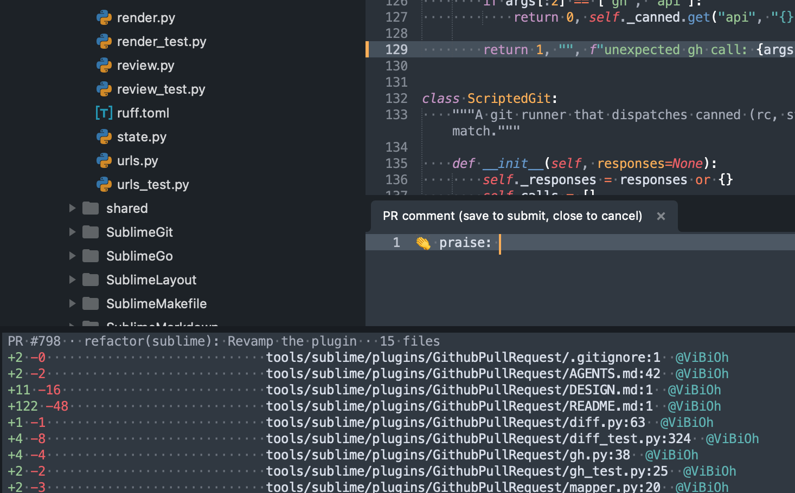

# GithubPullRequest

**Review GitHub pull requests without leaving Sublime Text.** 🔍



Threads render on the lines they belong to, the gutter shows the PR diff, and you can write, batch, and submit review comments from the editor. All of it on demand, and none of it touches your git state.

```
Command Palette → GithubPullRequest: Load pull-request
```

That is the whole ceremony. The PR is inferred from the branch you are on.

## ✨ Why

The github.com review UI is fine until you want to actually read the code. Then you lose your editor: LSP, go-to-definition, syntax highlighting, your keybindings, your muscle memory. This keeps the review where the code already lives.

And it stays out of your way: the plugin is completely inert until you load a PR, and it never runs a mutating git command.

## 🚀 Features

### 🧵 Threads on the code

Unresolved review threads get a blue gutter icon on the line they were written against. Hover one and the whole conversation opens in a popup, rendered from GitHub's own HTML: formatting, links, code blocks, task lists.

From the popup you can **Reply**, **Resolve** / **Unresolve**, **Open on github.com**, or **Apply** a `suggestion` block straight into your buffer.

### 🎨 Real diff in the gutter

Sublime's native diff gutter is repointed at the PR merge base, so you see exactly what the PR changed, per file, with zero checkout dance. Files added by the PR light up entirely green.

### 💬 Comments written like code

Select a line or a range, hit _Comment on line or selection_, and a compose buffer opens in a split **below** the file, so the code stays on screen. Markdown syntax, full editor power.

**Save submits. Close cancels.** Just like a git commit editor.

- 🏷️ **Conventional Comments built in.** A fuzzy label picker (`💡 suggestion`, `⚠️ issue`, `💅 nitpick`, `❓ question`, …) prefills the body. Fully configurable, or skippable, or off.
- ✍️ **Automatic suggestions.** If the lines you are commenting on carry your own uncommitted edits, the compose buffer is prefilled with a ready-to-post ` ```suggestion ` block containing your version. Fix it, then propose the fix, in one gesture. Removing lines works too.
- 📍 **Edit-proof anchoring.** Your local edits shift buffer rows; the plugin maps them back to the PR's head lines, so comments, icons, and suggestions all land on the right code even after you have been typing.

### 📦 Batched reviews, stored on GitHub

Queued comments become a real GitHub **pending review**, exactly like the web UI's "Start a review".

- 💜 Drafts get a purple gutter icon and an Edit / Discard popup.
- 🔄 They survive a crash, a restart, or a reboot: reload the PR and they come back.
- 👀 They are visible on github.com as pending until you submit.
- 🛟 If GitHub is unreachable when you queue one, it is kept locally instead of lost, and sent along when you submit.

Then submit everything in one shot with a verdict: **Comment**, **Approve**, or **Request changes**.

### 📋 Changed-files panel

A bottom panel lists every changed file with aligned, colorized stats:

```
+42 -7                            src/server/handler.go:118  @backend-team
    (2 unresolved) (1 pending)    src/server/handler.go:145
```

Double-click, Enter, or F4 jumps to the file at the right line. If the [`codeowners`](https://github.com/hmarr/codeowners) binary is on your `PATH`, each file also shows who owns it.

### 🧭 Navigation

- **Next / Previous comment** to walk the threads in a file.
- **List all comments** for a cross-file quick-panel of every thread, jumping straight to file and line.

### 🤖 Review with an agent

_Review with agent (tmux)_ splits your tmux session and launches your coding agent (`claude` by default, configurable) with a review prompt for this branch against its base. Read its findings, then write the ones you agree with as real review comments.

### 🔒 It never touches git

No `gh pr checkout`. No branch, no `reset`, no `stash`, no writes of any kind. Only read-only git (`show`, `merge-base`, `rev-parse`). Your working tree, index, and stash are exactly where you left them.

Everything that talks to GitHub goes through the [`gh`](https://cli.github.com/) CLI, so the plugin never reads or stores your token, and multi-org SAML SSO just works.

## 📥 Requirements

- **Sublime Text 4** (uses `minihtml`, `set_reference_document`).
- **[`gh`](https://cli.github.com/)**, installed and authenticated (`gh auth login`).
- You are **on the PR branch**. That is how the PR is inferred, and what makes the non-mutating diff possible.
- _Optional:_ [`codeowners`](https://github.com/hmarr/codeowners) on `PATH` for owner annotations, and `tmux` for the agent command.

## ⚙️ Install

Copy or symlink this directory into your Sublime `Packages/` folder as `GithubPullRequest`:

```sh
git clone https://github.com/ViBiOh/dotfiles.git
ln -s "$PWD/dotfiles/tools/sublime/plugins/GithubPullRequest" \
      "$HOME/Library/Application Support/Sublime Text/Packages/GithubPullRequest"
```

On Linux the target is `~/.config/sublime-text/Packages/`, on Windows `%APPDATA%\Sublime Text\Packages\`.

If you use this dotfiles repo, the installer does it for you:

```sh
tools/sublime/init.sh
```

## 🎮 Commands

All entries are prefixed `GithubPullRequest:` in the command palette.

| Command | What it does |
| --- | --- |
| **Load pull-request** | Infer the PR from the current branch, fetch files and threads, open the changed-files panel. Only open/draft PRs load. |
| **Show changed files** | The bottom panel of changed files, stats, comment counts, and owners. |
| **List all comments** | Quick-panel of every thread across the PR; jumps to file and line. |
| **Comment on line or selection** | Queue a review comment on the cursor line or the selected range. |
| **Next comment** / **Previous comment** | Walk the commented lines in the current file. |
| **Review with agent (tmux)** | Run your configured agent on this branch versus its base, in a tmux split. |
| **Submit review** | Pick a verdict and post every queued comment as one review. |
| **Discard queued comments** | Drop the whole draft queue, on GitHub too. |
| **End review** | Clear all decorations and state. Asks what to do with anything still queued. |

## 🔧 Settings

Override any of these in `Packages/User/GithubPullRequest.sublime-settings`.

| Key | Default | Meaning |
| --- | --- | --- |
| `auto_show_popup` | `true` | Show the thread/draft popup on hover. |
| `show_gutter_icon` | `true` | Draw gutter icons for threads and drafts. |
| `hide_outdated` | `true` | Hide outdated threads (their code changed, so they are usually mis-anchored). |
| `gutter_icon` | `"bookmark"` | `bookmark`, `dot`, `circle`, or a `Packages/...` png. |
| `conventional_comments` | `true` | Offer the [Conventional Comments](https://conventionalcomments.org) label picker before composing. |
| `comment_labels` | standard set | The labels the picker offers (`{emoji, label, description}`). `emoji` is optional and, when set, prefixes the posted comment. |
| `agent_command` | `["claude"]` | Agent to launch for **Review with agent**, e.g. `["claude", "--model", "opus"]` or `["aider", "--yes"]`. |
| `agent_review_prompt` | a review prompt | Appended to `agent_command`; `{base}` is replaced with the base branch. |

## 🧱 Known limitations

- One PR at a time, and you must be on its head branch.
- GitHub API caps apply on huge PRs (`/pulls/{n}/files` stops at 3000 files; very large and binary files ship no patch).
- No sidebar badges: Sublime exposes no API for it, hence the bottom panel.
- Not implemented: re-anchoring outdated comments, reactions, viewed-file state, CI checks.

## 🛠️ Hacking

The core (`urls`, `diff`, `mapper`, `render`, `gh`, `review`) never imports `sublime`, so it is unit-tested headlessly. Only `plugin.py` and `state.py` touch the editor API.

```sh
python3 -m unittest discover -p '*_test.py'
ruff check . && ruff format .
python3 -m py_compile plugin.py state.py
```

See `AGENTS.md` for the architecture tour and `DESIGN.md` for the interface contracts.
